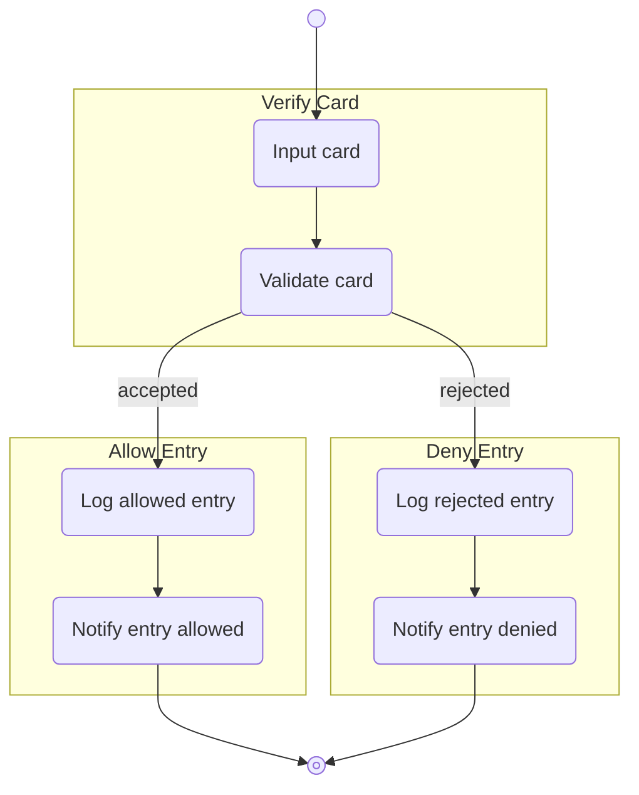
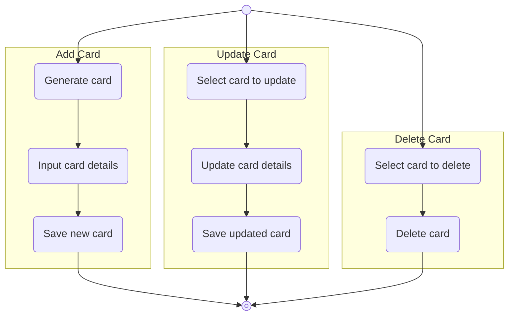

# Target System Roadmap

## Overview

## Outcomes
### Manage Entry Outcome

### Maintain Card Outcome

## Constraints

## Diagnostic Increment History 
| Version | Date | Increment | Package |
|---------|------|-----------|---------|

