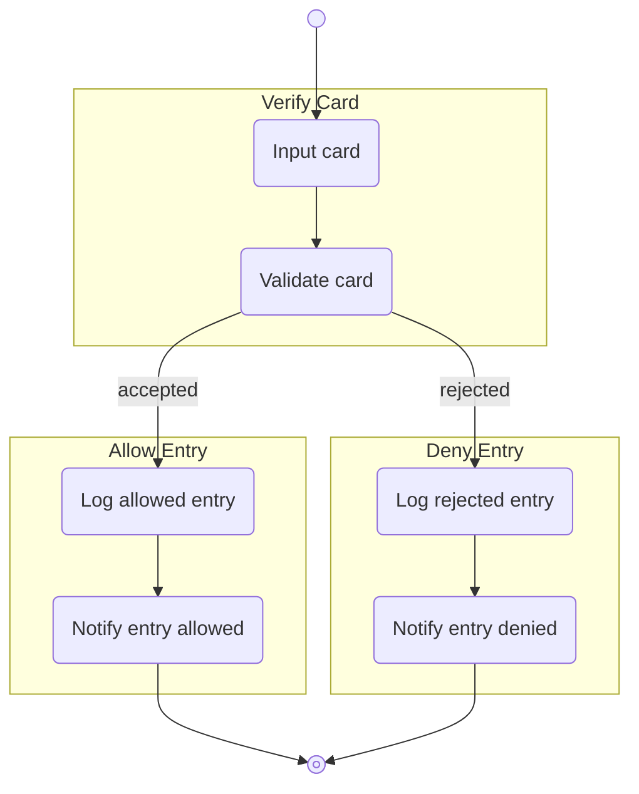
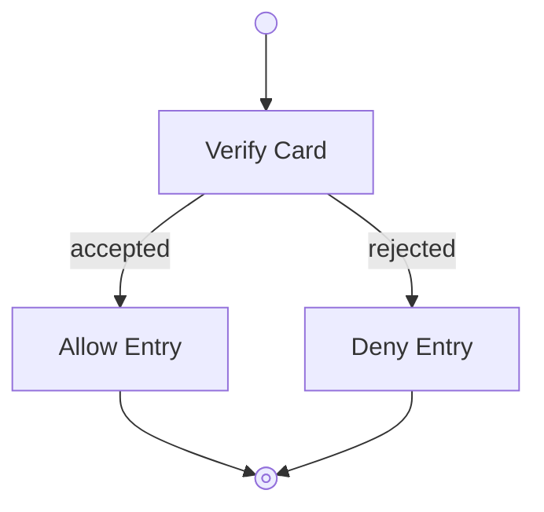
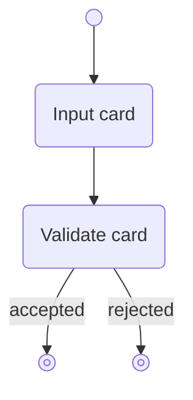
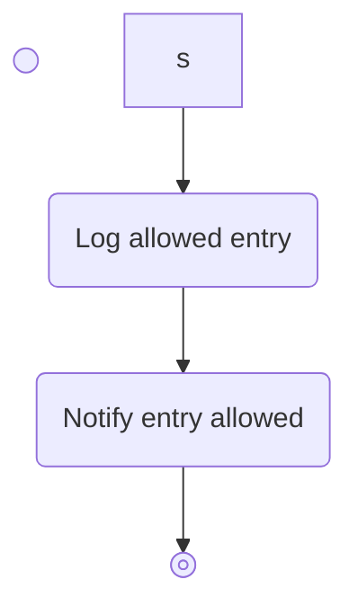
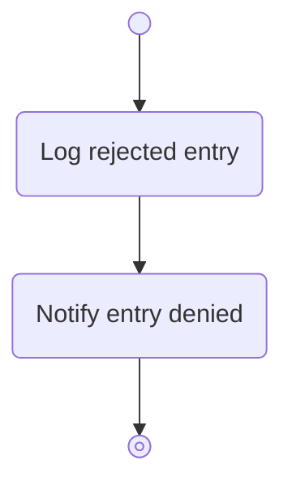
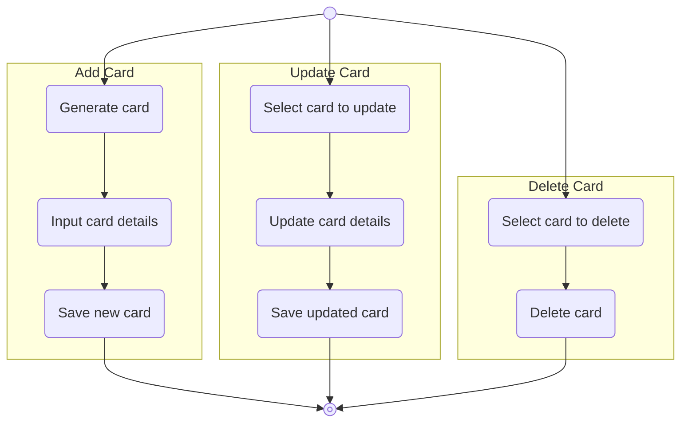
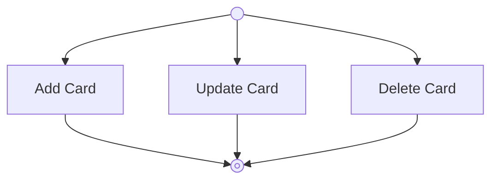
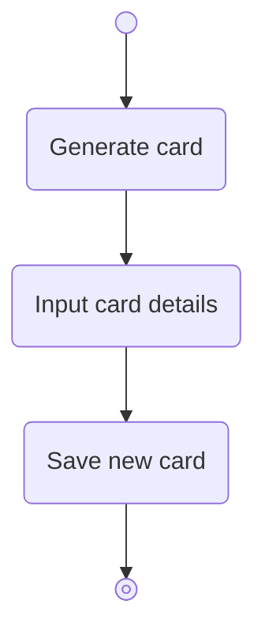
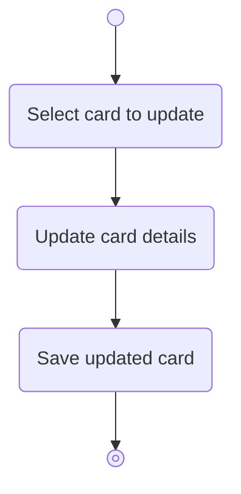
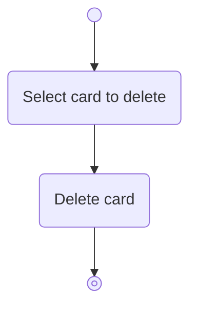

# System Vision

## Purpose:

## Manage Entry Outcome

### Level 1 Diagnostic 

### Level 2 Diagnostics—Verify Card

### Level 2 Diagnostics—Allow Entry

### Level 2 Diagnostics—Deny Entry

## Maintain Card Outcome

### Level 1 Diagnostic

### Level 2 Diagnostics-Add Card

### Level 2 Diagnostics-Update Card

### Level 2 Diagnostics-Delete Card
